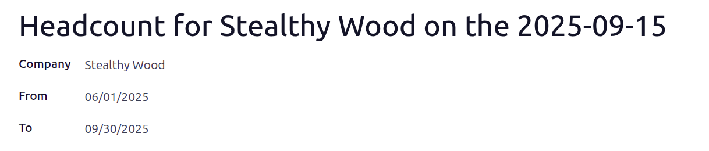

================
Headcount report
================

It can be helpful for companies to know how many employees are on their payroll. Additionally,
comparing headcounts between different periods of time can provide insight for management. In Odoo,
this can be done with the *Headcount* report in the **Payroll** app.

Create a headcount report
=========================

To create a headcount report, navigate to :menuselection:`Payroll app --> Reporting --> Headcount`.
Click the :guilabel:`New` button in the top-left corner, and a blank :guilabel:`Headcount` form
laods. The name for the report is populated on the first line, and **cannot** be modified. The name
follows the following format: `Headcount for (Company Name) on the (YYYY-MM-DD)`.

The company populates the :guilabel:`Company` field, and appears wether in a single *or*
multi-company database. The :guilabel:`From` field is populated with the current date, and the
:guilabel:`To` field is blank, by default. Modify the :guilabel:`From` and :guilabel:`To` dates to
capture the headcount of the sleected dates.

When everything is configured on the :guilabel:`Headcount` form, click the :guilabel:`Populate`
button to run the report. If the :guilabel:`From` and :guilabel:`To` dates are modified, the name is
updated to reflect the time period of the report.

A :icon:`fa-people` :guilabel:`Employees` smart button appears at the top of the screen, indicating
the number of employees during that time period.

View all headcount reports
==========================

Navigate to :menuselection:`Payroll app --> Reporting --> Headcount` to view a list of all headcount
reports in the database. This presents the :guilabel:`Headcount` dashboard, with all headcount
reports in a list view, in ascending chronological order.

Each report displays the number of employees in the :guilabel:`Employee Count` column, as well as
who ran the report (:guilabel:`Created by`), when the report was created in the dataabase
(:guilabel:`Last Updated on`), and what :guilabel:`Company` it was for.

View employees in a headcount
-----------------------------

To view the employees of a headcount report, click on a report in the :guilabel:`Headcount`
dashboard, then click the :icon:`fa-people` :guilabel:`Employees` smart button. All employees from
the headcount appear in a list view, grouped by :guilabel:`Department`.

Expand any row to view the details for those employees. Each employee listed displays the following
information:

-  :guilabel:`Employee`: the employee's full name
-  :guilabel:`Department`: the department their job position is in
-  :guilabel:`Job Title`: their role
-  :guilabel:`Employer Cost`: how much the company pays the employee each pay-period
- :guilabel:`Wage on Payroll`: the dollar amount on payroll reports

